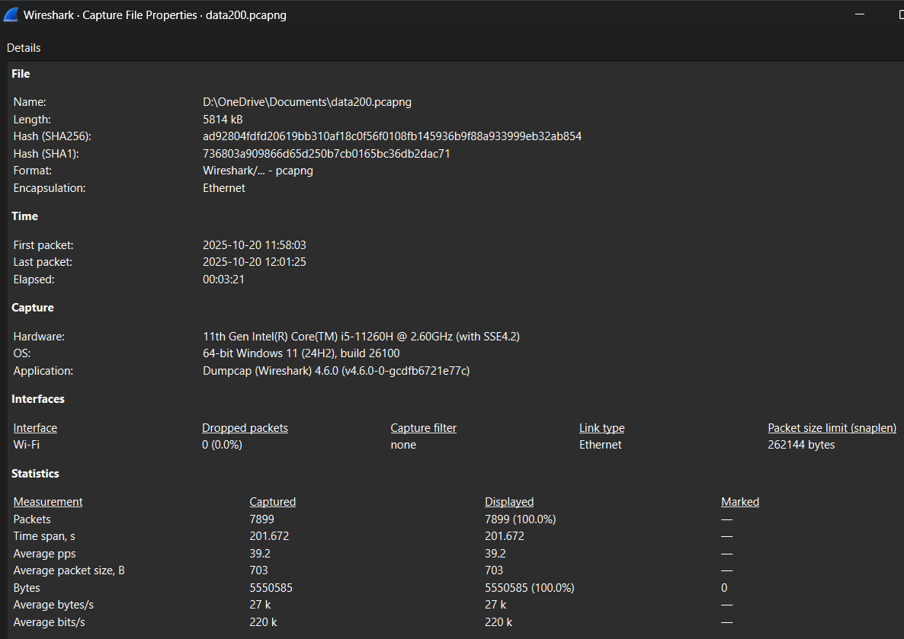
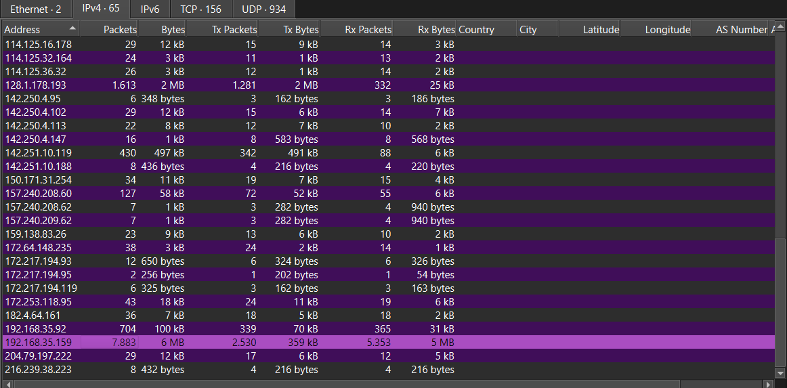
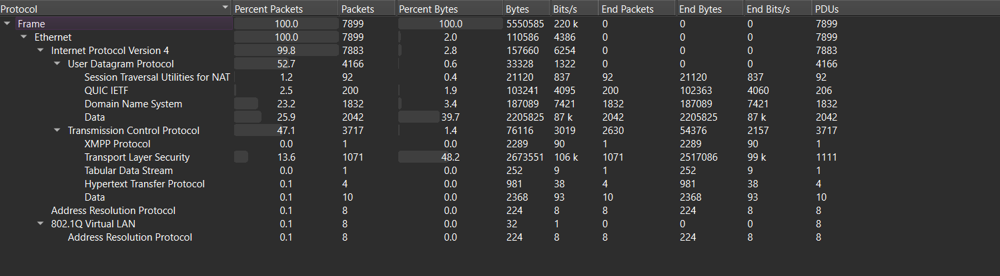
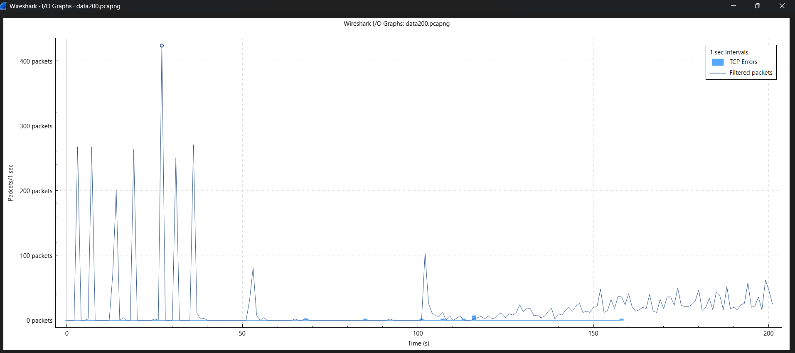
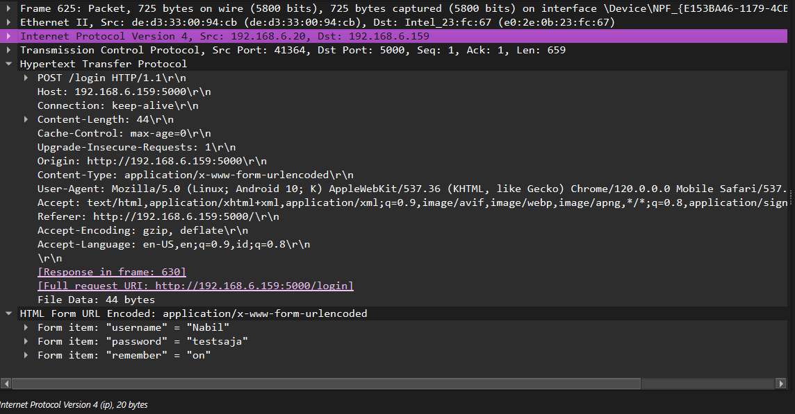

# Post Lab
Laporan praktikum matakuliah UCCN (Unified Communication & Collaboration Networking), dilengkapi dengan data capture dan visualisasi trafik.

Nama : Nabil Huda

NPM  : 2310017514009

# 1. Pendahuluan
Proses analisis lalu lintas jaringan memiliki peran penting dalam menjaga performa dan keamanan sistem jaringan. Dengan mengamati aliran paket data, administrator dapat menemukan sumber gangguan, mendeteksi aktivitas mencurigakan, serta memahami pola komunikasi antar aplikasi. Salah satu alat yang umum digunakan untuk keperluan ini adalah Wireshark, yaitu aplikasi analisis protokol jaringan yang mampu menangkap dan menelusuri paket data secara detail.

Praktikum ini bertujuan untuk melakukan kajian terhadap file tangkapan lalu lintas jaringan (.pcapng) yang telah tersedia. Dalam analisis tersebut, dilakukan identifikasi terhadap host yang paling aktif, protokol yang paling sering muncul, serta evaluasi terhadap adanya peningkatan atau lonjakan data pada jaringan. Hasil dari analisis ini diharapkan dapat memberikan pemahaman yang lebih baik mengenai pola komunikasi dan performa jaringan secara keseluruhan.

# 2. Tool yang Digunakan
Analisis ini dilakukan dengan menggunakan perangkat keras dan perangkat lunak berikut:

**- Hardware:** Laptop

**- Software:** Wireshark

# 3. Tahapan
Proses analisis data capture dari file data200.pcapng dilakukan melalui beberapa tahapan menggunakan fitur-fitur Wireshark:

a. Menjalankan Aplikasi Wireshark: Membuka aplikasi Wireshark pada laptop sebagai langkah awal untuk melakukan proses perekaman lalu lintas jaringan.

b. Memulai Proses Capture Data

    • Memilih interface jaringan Wi-Fi yang aktif.
    • Mengklik tombol Start Capturing Packets (ikon sirip hiu) untuk memulai perekaman.

c. Aktivitas Selama Proses Capture

    • Membuka peramban Microsoft Edge.
    • Mengakses halaman login web dari perangkat HP menuju server lokal (laptop) melalui protokol HTTP.

d. Menghentikan dan Menyimpan Hasil Capture: Setelah kegiatan selesai, klik Stop Capturing Packets (ikon persegi merah) dan simpan hasil tangkapan dengan nama post-lab.pcapng.

e. Meninjau Properti File Capture

    Melalui menu Statistics > Capture File Properties, dilakukan pemeriksaan metadata hasil tangkapan seperti total durasi, jumlah paket, serta waktu perekaman.

f. Menganalisis Hierarki Protokol

    Menggunakan menu Statistics > Protocol Hierarchy untuk memperoleh gambaran umum mengenai jenis protokol yang paling sering muncul selama proses capture.

g. Mengidentifikasi Host yang Paling Aktif

    Mengakses Statistics > Endpoints dan membuka tab IPv4 untuk mengurutkan daftar alamat IP berdasarkan jumlah paket atau total data (bytes) sehingga dapat diketahui host yang paling aktif.

h. Menganalisis Grafik I/O

    Melalui Statistics > I/O Graph, dilakukan visualisasi lalu lintas data (paket per detik) untuk melihat tren aktivitas jaringan dan menentukan waktu terjadinya puncak trafik.

i. Menelusuri Kredensial yang Terekam

    • Menerapkan display filter http.request.method == "POST" guna menyaring paket yang mengirimkan data menuju server lokal.
    • Memeriksa detail paket yang relevan (contohnya Paket 77) untuk melihat isi HTML Form URL Encoded.
    • Dari data formulir tersebut, dilakukan identifikasi terhadap username dan password yang dikirim dalam bentuk clear text (teks terbuka).

# 4. Hasil
Berdasarkan analisis file data200.pcapng, didapatkan temuan-temuan berikut:

A. Durasi Capture dan IP Address Paling Aktif

  • Total durasi perekaman adalah 201.672 detik (3 menit 21 detik). Total paket yang ditangkap adalah 7899 paket.

  • Alamat IP yang paling aktif pada sesi capture ini adalah 192.168.35.159. IP tersebut tercatat mengirim dan menerima sebanyak 7883 paket dengan total data mencapai 6 MB, jumlah yang jauh lebih tinggi dibandingkan alamat IP lainnya. Hal ini mengindikasikan bahwa 192.168.35.159 berperan sebagai host utama yang menjadi fokus pemantauan selama proses analisis.

B. Protokol yang Digunakan

Analisis Protocol Hierarchy pada file capture menunjukkan distribusi protokol sebagai berikut:

• Network Layer:
Lalu lintas jaringan sepenuhnya didominasi oleh Internet Protocol Version 4 (IPv4) dengan persentase sekitar 99.8% dari total paket, sementara protokol lainnya seperti ARP dan VLAN hanya menyumbang sebagian kecil (masing-masing sekitar 0.1%).

• Transport Layer:
Aktivitas komunikasi terbagi antara dua protokol utama, yaitu User Datagram Protocol (UDP) dengan 52.7% dari total paket, dan Transmission Control Protocol (TCP) dengan 47.1%.

• Application Layer:
Beberapa protokol aplikasi yang terdeteksi antara lain:

    - Domain Name System (DNS) – sekitar 23.2%, digunakan untuk resolusi nama domain ke alamat IP.
    - QUIC (IETF) – sekitar 2.5%, protokol berbasis UDP yang digunakan untuk koneksi terenkripsi modern.
    - Session Traversal Utilities for NAT (STUN) – sekitar 1.2%, berfungsi membantu koneksi melalui NAT pada komunikasi real-time.
    - Transport Layer Security (TLS) – sekitar 13.6%, menyediakan lapisan enkripsi untuk koneksi berbasis TCP seperti HTTPS.
    - Hypertext Transfer Protocol (HTTP) – hanya sekitar 0.1%, menandakan ada sedikit lalu lintas web tidak terenkripsi.
    - XMPP Protocol dan Data Stream lainnya – masing-masing di bawah 1%, menunjukkan lalu lintas minor yang tidak dominan.
    - Secara keseluruhan, data menunjukkan bahwa trafik pada sesi ini lebih banyak menggunakan UDP, terutama untuk layanan DNS dan QUIC, sementara TCP digunakan untuk komunikasi terenkripsi melalui TLS.

C. Puncak Penggunaan Data

Grafik I/O Graph menunjukkan pola lalu lintas jaringan yang berfluktuasi dengan beberapa lonjakan tajam di awal sesi perekaman. Aktivitas tertinggi terjadi sekitar detik ke-35, dengan jumlah paket mencapai lebih dari 400 paket per detik. Setelah periode tersebut, intensitas lalu lintas menurun drastis dan hanya menampilkan beberapa aktivitas ringan yang tersebar hingga akhir durasi capture (sekitar detik ke-200).

Lonjakan pada awal waktu ini kemungkinan besar disebabkan oleh aktivitas koneksi awal atau pertukaran data dalam jumlah besar, seperti proses inisialisasi komunikasi antar host atau pemuatan halaman web dengan banyak elemen data. Secara keseluruhan, grafik memperlihatkan bahwa mayoritas trafik terjadi di fase awal, sementara fase berikutnya cenderung stabil dengan volume paket rendah.

D. Temuan Kredensial (Username dan Password)

Untuk file yang digunakan pada temuan ini adalah file testhttp.pcapng.

• Temuan: Berhasil ditangkap sebuah transmisi data login yang dikirim tanpa enkripsi dengan menggunakan display filter http.request.method == "POST" untuk menyaring paket yang mengirimkan data ke server lokal yang saya jalankan.

• Protokol: Data tersebut dikirim melalui protokol HTTP (tanpa lapisan keamanan HTTPS).

• Tujuan (Target): http://192.168.6.159:5000 — yaitu server web lokal yang berada di laptop saya.

• Detail Paket:

    username = "Nabil"
    password = "testaja"
    remember = "on"

Temuan ini secara jelas menunjukkan risiko besar dalam penggunaan situs web tanpa enkripsi (HTTP). Siapa pun yang terhubung pada jaringan yang sama seperti pada WiFi publik dapat dengan mudah melakukan eavesdropping (menguping) dan memperoleh informasi sensitif, termasuk nama pengguna dan kata sandi, karena data dikirim dalam bentuk teks biasa tanpa perlindungan.
